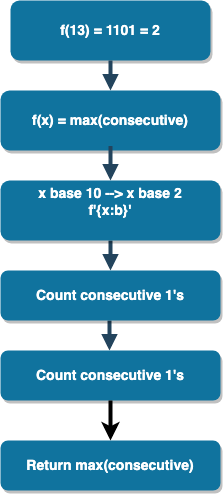

# Python Binary

> Given a base-10 integer, n, convert it to binary (base-2). Then find and print the base-10 integer denoting the maximum number of consecutive 1's in n's binary representation. - [HackerRank](www.hackerrank.com)

## Flow Chart

* Given n
* Turn n into binary
* Loop through n
  * If n is 1, result++ (initialize result)
  * else append to consecutive (initialize consecutive) and set result to 0
* append consecutive one last time after loop
* return max of consecutive



## Code

* **Given n**

```python
def con_ones(n):
  """Calculate the max number of consecutive 1's from binary."""
```

* **Turn n into binary**

```python
f'{n:b}'
```

* **Loop through n**

```python
def con_ones(n):
  """Calculate the max number of consecutive 1's from binary."""
  for i in [int(j) for j in f'{n:b}']:
```

* **If n is 1, result++ (declare result first)**

```python
def con_ones(n):
  """Calculate the max number of consecutive 1's from binary."""
  result = 0
  for i in [int(j) for j in f'{n:b}']:
    if i:
      result = result + 1
```

* **else append to consecutive (declare consecutive first) and set result to 0**

```python
def con_ones(n):
  """Calculate the max number of consecutive 1's from binary."""
  result = 0
  consecutive = []
  for i in [int(j) for j in f'{n:b}']:
    if i:
      result = result + 1
    else:
      consecutive.append(result)
      result = 0
```

* **append consecutive one last time after loop and return max of consecutive**

```python
def con_ones(n):
  """Calculate the max number of consecutive 1's from binary."""
  result = 0
  consecutive = []
  for i in [int(j) for j in f'{n:b}']:
    if i:
      result = result + 1
    else:
      consecutive.append(result)
      result = 0
    
  consecutive.append(result)  
  return max(consecutive)
```

## Solution

```python
#!/bin/python3

import math
import os
import random
import re
import sys

def con_ones(n):
  """Calculate the max number of consecutive 1's from binary."""
  result = 0
  consecutive = []
  for i in [int(j) for j in f'{n:b}']:
    if i:
      result = result + 1
    else:
      consecutive.append(result)
      result = 0
    
  consecutive.append(result)  
  return max(consecutive)


if __name__ == '__main__':
    n = int(input())
    print(con_ones(n))

```

# Conclusion

Got to learn how to turn a number into binary so that was cool. Also, trying out a flowchart (it was O.K.) and even wrote it down on the white board first (just for more of a warmup and because it was fun).
